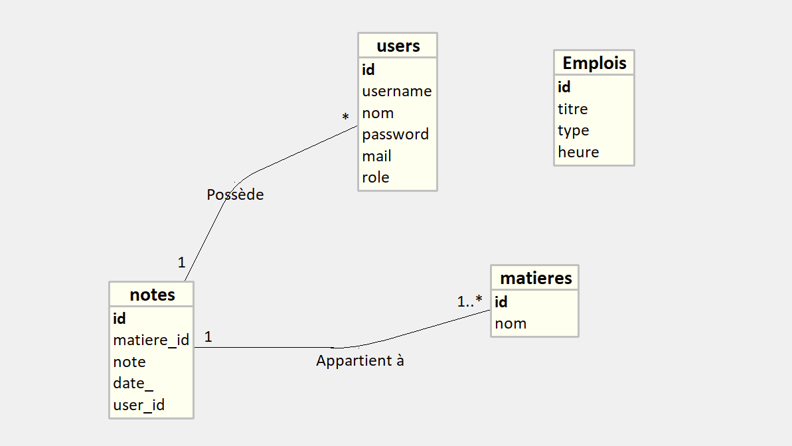

# Projet Web2

Un projet web développé en PHP et CSS, comprenant diverses fonctionnalités pour gérer les utilisateurs, afficher des profils, gérer les notes et bien plus. Ce projet est une application web dynamique avec un backend basé sur PHP.

---

## Arborescence du Projet

Voici les principaux dossiers et fichiers inclus dans ce projet :

- **`assets/`** : Contient les fichiers de style CSS et les ressources comme le logo.
  - `logo.png` : Logo de l'application.
  - `styles.css` et fichiers spécifiques (`styles_accueil.css`, `styles_login.css`, etc.) : Styles pour différentes pages.
  
- **`includes/`** : Contient les fichiers de configuration ou d'inclusion.
  - `db.php` : Script pour gérer la connexion à la base de données.

- **`pages/`** : Contient les fichiers PHP pour différentes fonctionnalités.
  - `add_user.php` : Ajouter un utilisateur.
  - `contact.php` : Page de contact.
  - `dashboard.php` : Tableau de bord de l'application.
  - `edit.php` : Page pour modifier des données.
  - `login.php` et `logout.php` : Gestion des sessions utilisateurs.
  - `note.php` : Gestion des notes.
  - `page_accueil.php` : Page d'accueil.
  - `page_profile.php` : Page de profil.

- **Fichiers principaux** :
  - `index.php` : Point d'entrée principal de l'application.
  - `LICENSE` : Fichier indiquant la licence du projet.
  - `readme.md` : Documentation du projet.

---

## Installation

1. **Cloner le dépôt** :
   ```bash
   git clone https://github.com/kilianMeddas/projet_web2.git

2. **Configurer votre environnement** :

    - Assurez-vous d'avoir un serveur web (comme XAMPP ou WAMP) avec PHP installé.
    - Configurez votre base de données en utilisant les paramètres dans db.php.

3. **Lancer l'application** :

    - Placez les fichiers dans le dossier de votre serveur web (ex : htdocs pour XAMPP).
    - Accédez à l'application via votre navigateur à http://localhost/projet_web2.

  _____________________________________________________________________________________

## Fonctionnalités
- **Connexion/Inscription** : Système de gestion des utilisateurs.
- **Tableau de bord** : Vue centralisée des données importantes.
- **Profil utilisateur** : Gestion et modification du profil utilisateur.
- **Gestion des notes** : Ajouter, modifier ou supprimer des notes.
- **Page de contact** : Formulaire de contact pour les utilisateurs.

_______________________________________________________________________________________

## Auteurs
Meddas Kilian et Perales-ludden Sean


_________________________________________________________________________________________

## Annexe


